# DigiPen Korea Gamejam Winter 2024

## Theme

> One Room

Your game must incorporate the theme **"One Room"** somehow.

### Requirements

1. Must contain the voice of each team member
2. Must contain at least one smile

## Agenda

Day 1: Friday
* 10:00 - 12:00  Getting to know each other / ice breakers / group forming
* 12:00 - 13:00  Lunch and Social Time
* 13:00 - 14:00  Group pitches - what is each group planning to make
* 14:00 onwards  Teams start jamming
 
Day 2: Saturday
* 10:00 - 11:00 Game uploads to the website
* 11:00 - 12:00 Short presentations - each team does a short presentation or game play video to show the group
* 12:00 - 13:00 Lunch
* 14:00 - 15:00 Play each others games
* 15:00 - 16:00 Clean up and close

## Submission Requirements

Submissions must contain:

1. Compressed archive of a runnable executable
2. Screenshot of Game or Image to represent your game
3. ReadMe file that defines
    - Names of team members
    - Bried Intro to Game
    - How to interact with the Game
    - (optional) Describe how the game reflects the theme

You can submit these directly to Prof Rudy Castan or make a pull request that addes the submission in the `submissions` folder

## Submitted Games

### Super U.R.U.K "One Room" Rampage

~ Art, Programming, Sound Design, etc ~

    SeungGeon Kim

~ The Story ~

    One day, a giant fire breathing fish, U.R.U.K, went to a contemporary art exhibition and was moved deeply by the paintings.
He was moved so deeply that he decided to destroy all rooms of some buildings in town... Just leaving a single room.
However, since his fireball was coded to only follow a living human, you, a living human, will help him tidy up the buildings,
supporting U.R.U.K's first bold step as a contemporary artist.
 
~ Controls ~

    WASD to move
    SPACE to dash

All the rooms get blown up except for a single room... So "One Room" it is!
Also, the Sun is smiling, and some of U.R.U.K's voices were recorded by me.

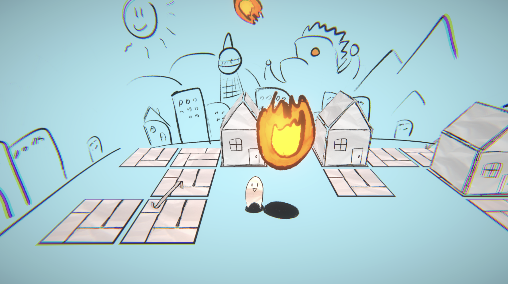 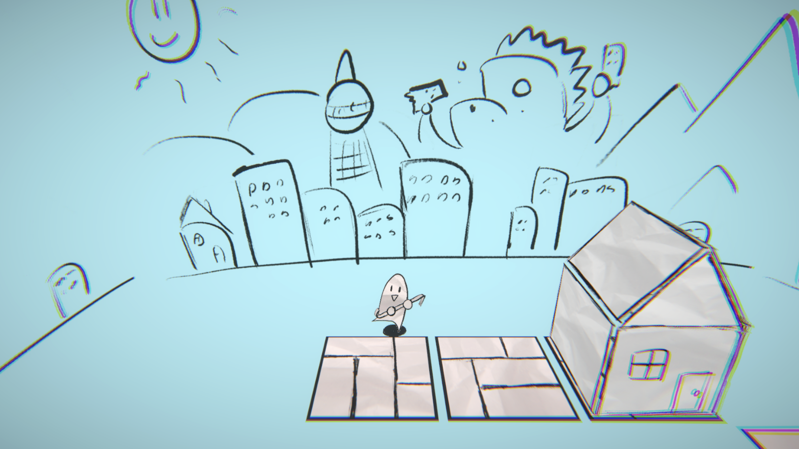 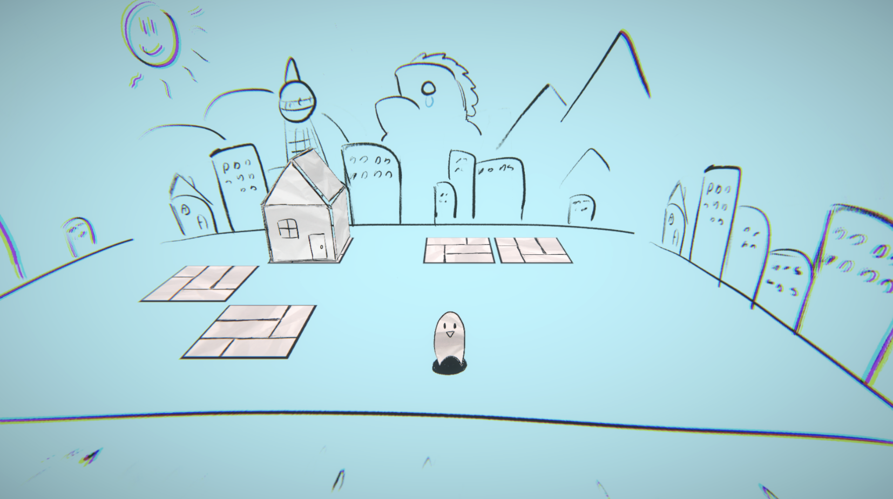

Download Windows Version here : [Super_U.R.U.K_One_Room_Rampage.7z](submissions/Super_U.R.U.K_One_Room_Rampage/Super_U.R.U.K_One_Room_Rampage.7z)

Source Code on GitHub : https://github.com/ktrack723/One-Room

### Smile, Programmer!

1. Names of team members
    Haneul Lee, Yeaseul Lim, Junhyeong Kim

2. Brief Intro to Game
    As a topic of this GameJam(One room), we decided to focus on life of programmer who works in the small house with only one room.
    In this game, players are going to be a poor programmer who works from home, and who got the very good works that can earn big money.
    However, it is unavailable to do with his poor machine, especially lack of monitors!
    So he work as hard as possible to buy monitor and to finish the work he got. He need to eat, drink, rest, and some natural thing :)
    Player have to make these "health points" to appropriate level to survive(which means, to work) and if this ratio got declined,
    he got tired and show us his lack of performance of work.
    So player have to take care about these things. Also, to get money easier, there are some furnitures that can inclined the performance
    of this tiny poor programmer. Player can buy the furniture to get more money!
    And to finish the BIG job he have to do, player have to manually play the simple rhythm games to go to next stage. Of course, we need
    many monitors too! If programmer finished the last rhythm game, the full game ended with big smile face in the all monitors that
    player must buy to clear the game.

3. How to interact with the Game
    In main menu, you can easily get into the game with "enter" or to exit with "esc" keyboard key. And you can click the mouse to get
    access the phone UI to buy something, and besides that, almost everything are works with arrow keyboard keys, right shift key, enter or spacebar.
    Player have to maintain the characters status, and also player have to clear the rhythm game to complete the game.

4. Describe how the game reflects the theme
    In this game, programmer's home is one room. So we want to make the game with life of programmer, some simulations, little bit hands-free.
    We try to fill up the small one room with the furnitures that player can buy in games. And I think we did pretty good job so far! :) 

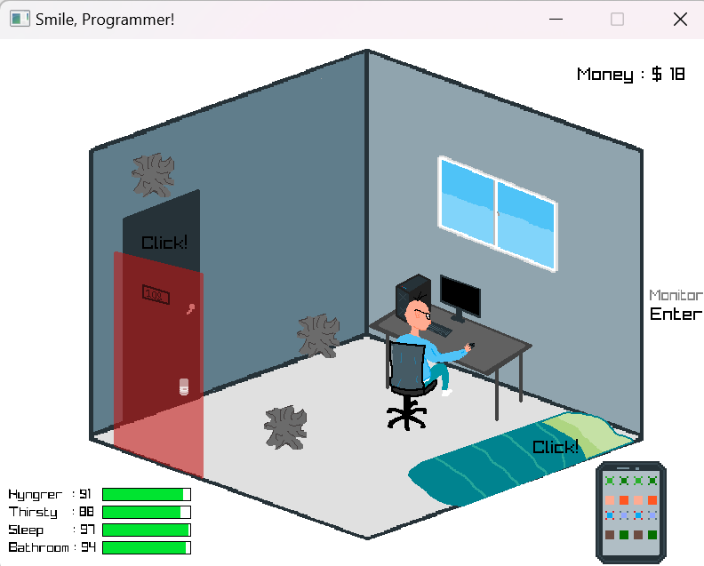 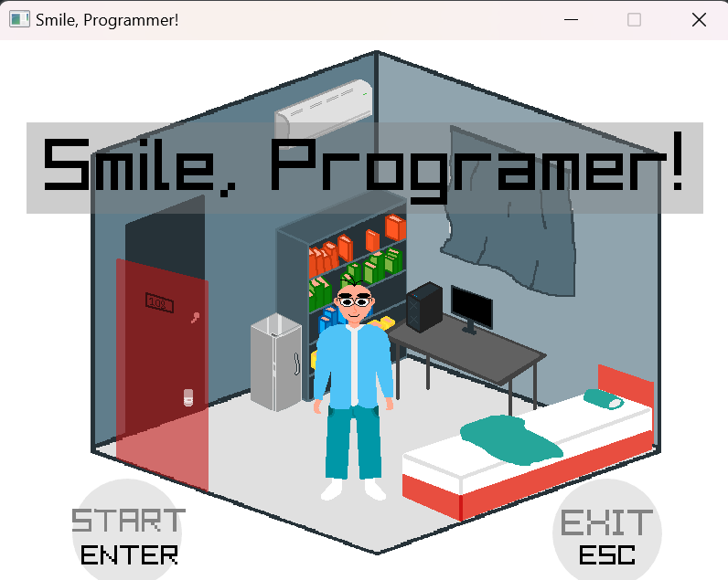 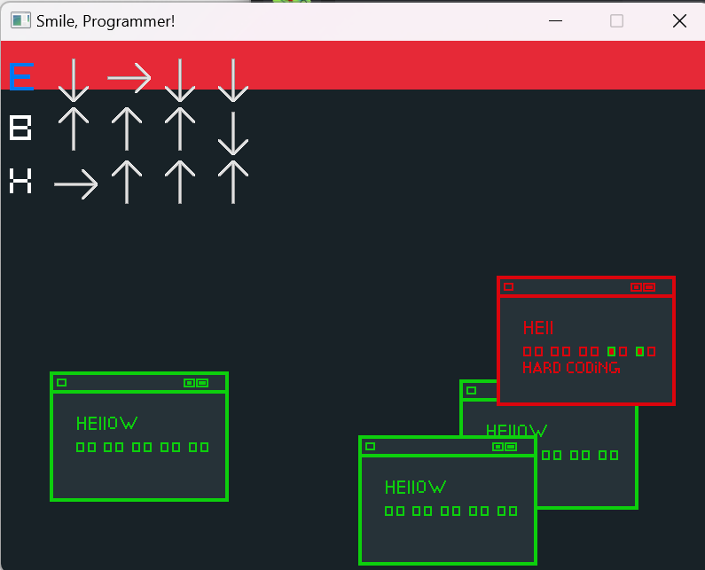 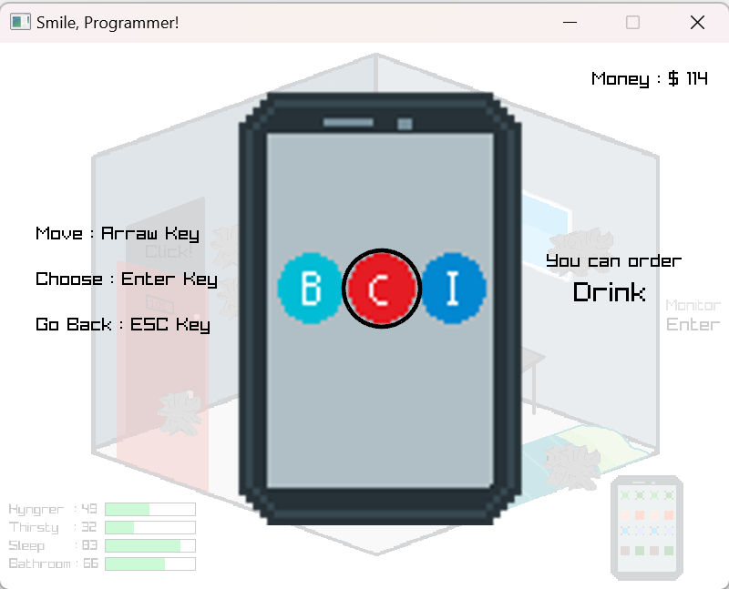

Download Windows Version here : [SmileProgrammer.7z](submissions/SmileProgammer/SmileProgrammer.7z)

### Dice Maze

- Game name : Dicemaze

- Team members :
    - Huiuk Jang
    - Seohyeon Min
    - Hyeoenseong Bae
    - Jaejin Chae
    - Dohyung Kwon

- game intro : In this game you will encounter 4 maps. But not one by one. Maze will keep changing the place you're at. Walls and floor you are stepping on won't be same as 30 second before. So find the way out, remember the how it was, and be lucky.

##### How to play

###### arrow keys
Player can move with keyboard arrow keys.

###### space key
Players can interaction using the space key.

##### Theme
Each map is one side of the dice. Changing maps are caused by dice being rolled. As player is inside the dice it can be considered as one room.

#### Screenshots

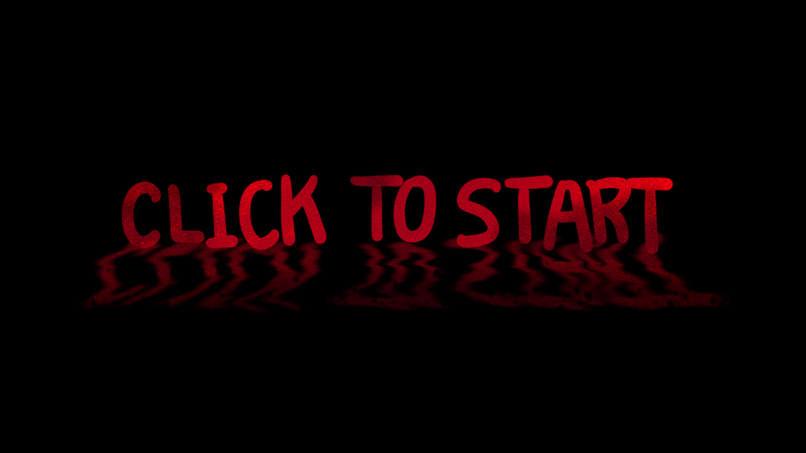 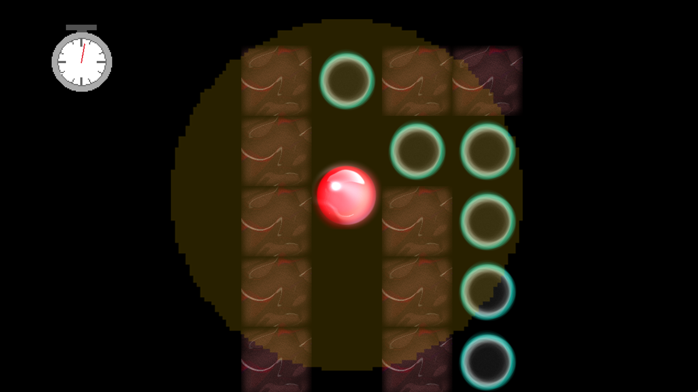 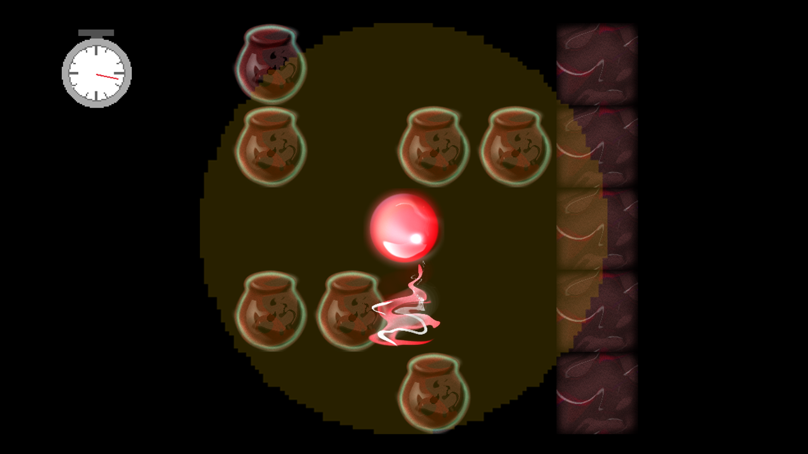 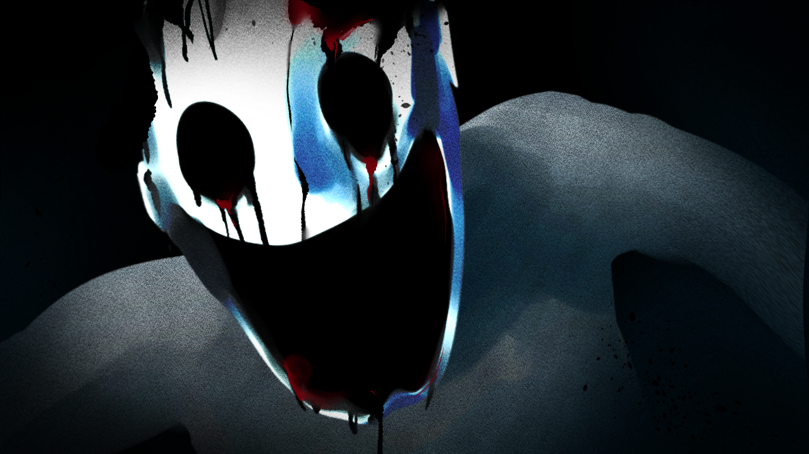 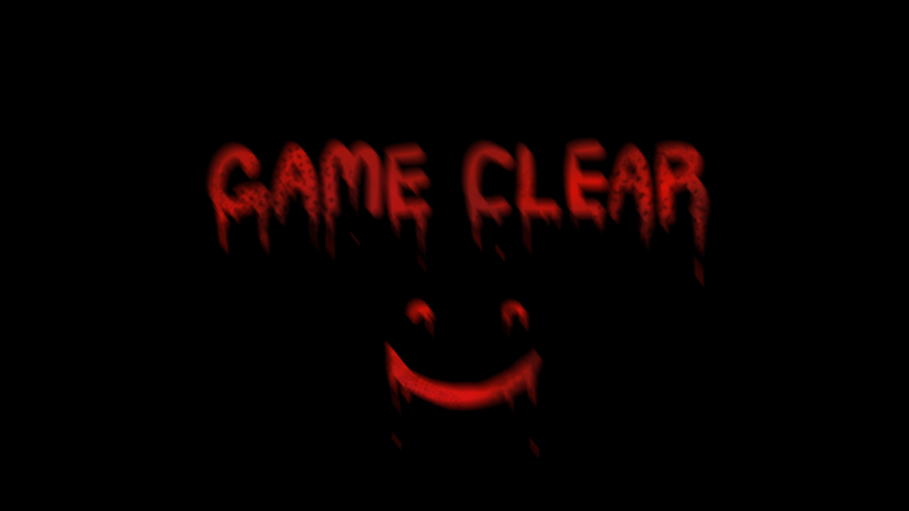

Download Windows Version here : [DiceMaze.7z](submissions/DiceMaze/DiceMaze.7z)

